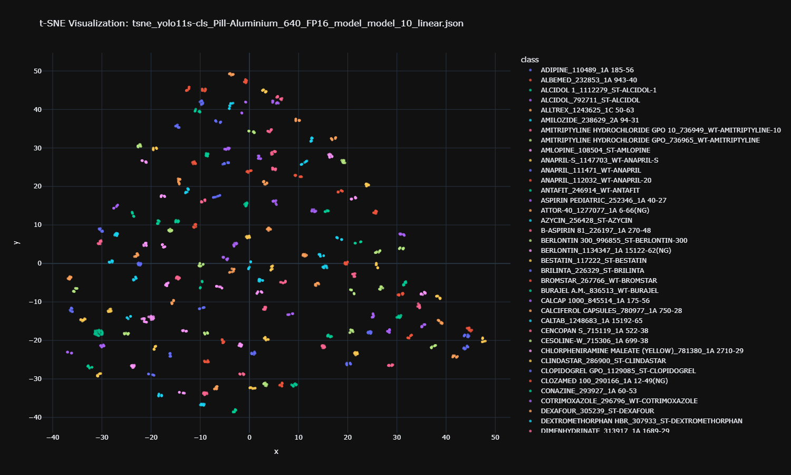

# 🕵️ YOLO Dataset Auditor & t-SNE Visualizer



A powerful toolkit to visualize dataset clusters and automatically detect labeling errors using **Ultralytics YOLO** models (v8, v11, v12).

This tool extracts deep feature vectors from your images, projects them into 2D space using t-SNE, and uses **k-Nearest Neighbors (k-NN)** to identify "Suspicious" data points (e.g., a "Cat" image sitting deep inside a "Dog" cluster).

---

## 🌟 Key Features

*   **Universal Support:** Works with **YOLOv8, YOLOv11, YOLOv12** (Detect, Classify, Pose, Segment, OBB).
*   **Smart Inspection:** Automatically identifies the best layers to hook for feature extraction.
*   **Robust Caching:** Supports massive datasets (100k+ images). If interrupted, it **resumes exactly where it left off**.
*   **Ghost Mode Visualization:** A specialized plotting mode that makes clean data transparent and highlights potential errors.
*   **Actionable Reports:** Generates a CSV list of mislabeled images to fix.

---

## 📂 Project Structure

```text
.
├── util/
│   ├── __init__.py
│   └── YoloFeatureExtractor.py   # Core logic engine
│
├── 1_inspect_model.py            # Step 1: Find the right layer
├── 2_generate_tsne.py            # Step 2: Extract features & t-SNE
├── 3_view_plot.py                # Step 3: Interactive Scatter Plot
├── 4_analyze_errors.py           # Step 4: AI Conflict Detection
│
├── models/                       # Place your .pt files here
├── DATASET/                      # Place your images here
└── requirements.txt
```

---

## 🚀 Installation

1.  **Clone the repository** (or download the files).
2.  **Install dependencies:**

```bash
pip install ultralytics scikit-learn pandas plotly tqdm
```

*(Note: GPU is recommended for Step 2, but CPU works fine for smaller datasets.)*

---

## 📖 Usage Workflow

Follow these 4 steps to clean your dataset.

### Step 1: Inspect Your Model
Different YOLO versions have different architectures. Run this to find the layer names.

1.  Open `1_inspect_model.py`.
2.  Set your `MODEL_PATH`.
3.  Run:
    ```bash
    python 1_inspect_model.py
    ```
4.  **Action:** Copy the recommended **Layer Name** from the output (e.g., `model.model.22` or `model.model.10.linear`).

### Step 2: Generate Data (The Heavy Lifting)
This extracts features from all images and calculates t-SNE coordinates.

1.  Open `2_generate_tsne.py`.
2.  Configure the settings at the top:
    ```python
    MODEL_PATH   = "models/yolo11s.pt"
    DATA_DIR     = "./DATASET/my_images"
    TARGET_LAYER = "model.model.22"  # Paste layer from Step 1
    ```
3.  Run:
    ```bash
    python 2_generate_data.py
    ```
    *   *Result:* Creates a `.json` file in `tsne_results/`.
    *   *Note:* You can stop this script (Ctrl+C) anytime. It will resume automatically next time.

### Step 3: View Clusters
Check the general health of your dataset.

1.  Open `3_view_plot.py`.
2.  Set `JSON_FILE` to the file created in Step 2.
3.  Run:
    ```bash
    python 3_view_plot.py
    ```
    *   *Result:* Opens an interactive HTML plot in your browser.

### Step 4: Analyze Errors (Ghost Mode)
Find the wrong labels. This uses k-NN to find images surrounded by the wrong class.

1.  Open `4_analyze_errors.py`.
2.  Set `JSON_FILE` to the file created in Step 2.
3.  Run:
    ```bash
    python 4_analyze_errors.py
    ```
    *   *Result A:* Opens **`_focus_map.html`**. Suspicous points are **Solid Diamonds**; Clean points are **Faint Circles**.
    *   *Result B:* Saves **`_fix_list.csv`**. A prioritized list of files to fix.

---

## 🛠️ Configuration & Tips

*   **Handling Large Datasets (100k+ images):**
    *   Step 2 is safe to interrupt. It caches progress in the `cache/` folder.
    *   If you *retrain* your model, **rename the model file** (e.g., `v1.pt` -> `v2.pt`) to force the script to ignore the old cache.
*   **Perplexity:**
    *   In `2_generate_data.py`, set `PERPLEXITY = 30` (default).
    *   For huge datasets, you can try `50`.

---

## 📊 Output Explanation

*   **`_focus_map.html`**: The best tool for visual inspection.
    *   **Double-click** a class in the legend to isolate it.
    *   **Hover** over a Diamond to see: *"Class: Cat, Likely: Dog"*.
*   **`_fix_list.csv`**:
    *   Sort by `conflict_score`. A score of `1.0` means 100% of neighbors disagree with the current label (High probability of error).

---

## License

MIT License. Feel free to modify and use for your own projects!